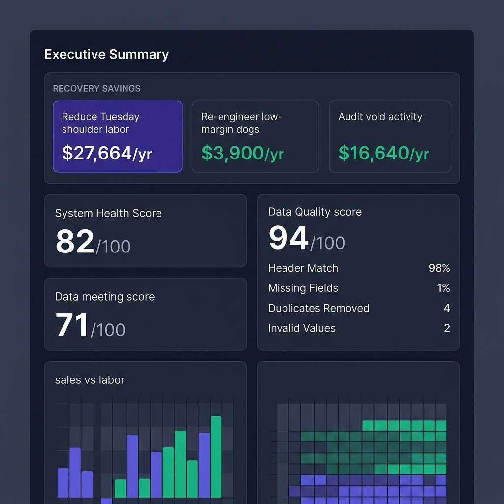
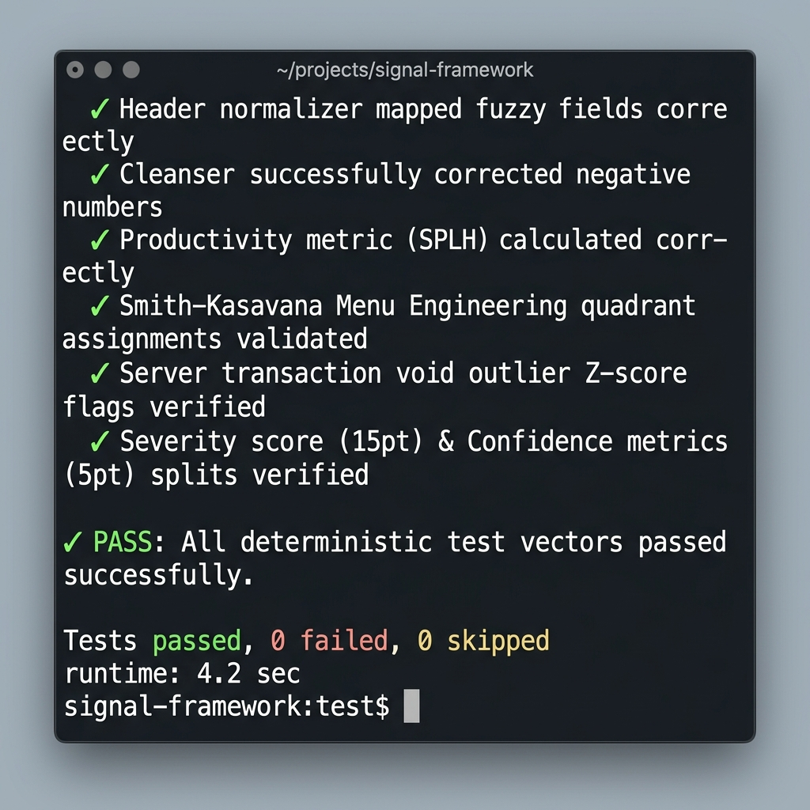

# Signal Operations Intelligence


> **Signal is a deterministic evaluation framework that transforms inconsistent operational data into standardized schemas, validates input quality, computes explainable diagnostics, and produces prioritized recommendations. Restaurant operations are used as the demonstration domain for a generalized evaluation pipeline.**

> **Disclaimer:** This repository demonstrates architecture, evaluation methodology, and data normalization concepts. Production scoring models and commercial rule sets are intentionally simplified for portfolio purposes.

---

## System Architecture

```text
Raw Reports
     │
     ▼
Normalize
     │
     ▼
Validate
     │
     ▼
Evaluate
     │
     ▼
Prioritize
     │
     ▼
Generate Report
```

---

## System Interface Preview


*Figure 1: Signal Interactive Operations Dashboard (System health score, data quality validation, and prioritized decision support findings).*


*Figure 2: Built-in deterministic test runner demonstrating 100% assertions pass rate on incoming sample vectors.*

---

## Why I Built This

Restaurant operators have access to enormous amounts of data but often lack structured decision support. Signal demonstrates how deterministic evaluation frameworks can normalize inconsistent inputs, validate quality, and surface actionable insights. The same architectural principles apply to AI evaluation, data annotation, and operational diagnostics.

---

## Design Principles

* **Deterministic over opaque**: Hard-coded math, clear thresholds, and reproducible calculations replace "black box" machine learning or opaque heuristics for auditability.
* **Explainable over black-box**: Every diagnostic insight links directly back to the raw records and parameters that triggered it, complete with mathematical formulas and step-by-step evidence.
* **Human-auditable outputs**: Decision support recommendations and metrics are designed to be read, verified, and exported by human operators, preserving trust.
* **Confidence-aware recommendations**: Each decision support entry includes a confidence grading score based on data completeness and signal stability.
* **Data quality before decision quality**: Checking schemas, bounding numeric outliers, and resolving duplicate records occurs *before* evaluating operational health.

---

## Quick Start: Try the Demo

1. **Clone the Repository:**
   ```bash
   git clone https://github.com/yourusername/signal-ops-intelligence.git
   cd signal-ops-intelligence
   ```
2. **Run Locally:**
   Simply double-click `index.html` to open the application in any modern web browser. Since it operates entirely client-side, **no local server or installations are required**.
3. **Load a Preset Profile:**
   Use the **Client Presets** buttons at the top right (e.g. *Bistro Royale*, *Urban Slice*, *Morning Grind*, *Campus Cafe*) to instantly load pre-populated datasets and trigger the complete analysis.
4. **Trigger Custom Audits:**
   Navigate to the **Pipeline Control & Logs** tab to view the raw CSV structures, load raw CSV logs, map custom columns with the Normalization Wizard, or trigger a manual ingestion cycle.

---

## Portfolio Purpose

Signal is a systems-building portfolio project designed to demonstrate data normalization, quality checks, deterministic diagnostic logic, anomaly scoring, and actionable decision support design.

The goal is not to present a flashy restaurant dashboard. The goal is to show how messy operational data can be converted into structured, auditable insights using clear rules, documented assumptions, and repeatable evaluation workflows.

---

## What Recruiters Should Notice

* **Data Quality Engineering over Business Heuristics**: The core focus is on the data pipeline. It evaluates the *validity* and *consistency* of the data itself (using deduplication, absolute-value bounding for negative hours, and average interpolation for missing cells) before executing business rules.
* **Granular Grader Rubrics**: Rather than flat anomaly flags, decision support findings are graded on two separate dimensions: a **15-point Severity scale** (measuring financial impact, risk, and frequency) and a **5-point Confidence checklist** (confirming completeness, pattern stability, and timestamp alignment).
* **Statistical Outlier Detection (Z-Score)**: The void logs audit evaluates cashiers using standard deviations ($z \ge 1.5$) against active shift averages. This prevents global check errors from falsely triggering anomalies on individual cashiers.
* **Verifiable Mathematical Logic**: The calculations are completely transparent. Every finding includes an "Explain this Finding" drawer displaying the math behind the deviation, the specific baseline and threshold triggers, and the list of triggered rules.
* **Deterministic Unit Tests**: The mathematical calculations (Smith-Kasavana menu categories, SPLH, Z-scores, and grading metrics) are fully verified on launch with a local test suite visible in the **Test Vectors Suite** tab.

---

## Why This Project Matters for AI Operations

Signal demonstrates the same core skills required in AI evaluation and data-quality work: turning messy inputs into structured outputs, defining consistent evaluation criteria, identifying anomalies, documenting decision logic, and converting ambiguous information into repeatable workflows.

| AI Evaluation Challenge | Signal Implementation Parallel | Source Reference |
| :--- | :--- | :--- |
| **Parsing Drifting Outputs** | Heuristic column normalizer that maps varying POS formats to standard schema keys | [parsers.js](file:///C:/Users/threa/.gemini/antigravity/scratch/signal-ops-intelligence/js/parsers.js) |
| **Human-in-the-Loop Override**| Halts ingestion on ambiguous headers and prompts manual resolution via Mapping UI | [parsers.js](file:///C:/Users/threa/.gemini/antigravity/scratch/signal-ops-intelligence/js/parsers.js) |
| **Pipeline Telemetry** | Waterfall progress checklist auditing parsing, deduplication, range validity, and diagnostics | [app.js](file:///C:/Users/threa/.gemini/antigravity/scratch/signal-ops-intelligence/app.js) |
| **Deterministic Grading** | Implements standard metrics formulas (SPLH, COGS, contribution margin) | [diagnostics.js](file:///C:/Users/threa/.gemini/antigravity/scratch/signal-ops-intelligence/js/diagnostics.js) |
| **Grader Severity** | Multi-dimensional scoring framework: $S = \text{Financial} (1-5) + \text{Frequency} (1-5) + \text{Ops Risk} (1-5)$ | [evaluation.js](file:///C:/Users/threa/.gemini/antigravity/scratch/signal-ops-intelligence/js/evaluation.js) |
| **Grader Confidence** | Evaluator confidence: $C = \frac{\text{Completeness} + \text{Stability} + \text{Quality}}{3}$ | [evaluation.js](file:///C:/Users/threa/.gemini/antigravity/scratch/signal-ops-intelligence/js/evaluation.js) |
| **Explainable Audits** | "Explain this Finding" drawer displaying rules triggered and observed vs baseline margins | [app.js](file:///C:/Users/threa/.gemini/antigravity/scratch/signal-ops-intelligence/app.js) |

---

## Data Ingestion & Transformation Pipeline

The ingestion engine converts raw, inconsistent CSV files into structured JSON schemas, correcting negative numbers and interpolating missing costs.

```text
Raw CSV (Messy Ingest)
------------------------------------------------------------------------------------
product_name,dept_group,qty_sold,net_revenue_total,recipe_cost,retail_price
Crispy Calamari,Appetizers,85,1190.00,N/A,14.00
------------------------------------------------------------------------------------
                                         ↓ 
                    Normalized Schema Model (Clean JSON)
------------------------------------------------------------------------------------
{
  "itemName": "Crispy Calamari",
  "category": "Appetizers",
  "quantity": 85,
  "sales": 1190,
  "itemCost": 4.20,              // Programmatically interpolated from category averages
  "price": 14.00,
  "contributionMargin": 9.80,    // Computed
  "salesMixPercent": 10.36,      // Computed
  "classification": "Puzzle"     // Determined via Smith-Kasavana heuristics
}
------------------------------------------------------------------------------------
```

---

## Export Options

Signal supports multi-format report exports for stakeholders:
* **Print / Save as PDF**: Toggling the *Print / Save as PDF* button applies custom CSS media queries (`@media print`) that strip out navigation tabs, log consoles, and buttons, formatting the dashboard into a clean, document-styled executive report.
* **Export Audit JSON**: Exports the complete processed telemetry state (including normalized logs, KPIs, recommendations, and Z-score calculations) as a standardized JSON data file.
* **Export Findings MD**: Compiles finding cards, mathematical evidence, and action protocols into a formatted Markdown document suitable for integration into external dashboards or wikis.

---

## Ingest Testing Vectors

Signal incorporates a deterministic assertions suite running both in Node.js and directly in the browser UI under the **Test Vectors Suite** tab.

* **Parser Test**: Validates header mapping heuristics, deduplication filters, and missing data interpolations.
* **Diagnostics Test**: Asserts SPLH averages, Prime Cost ratios, Smith-Kasavana menu classifications, and Z-score server void deviations.
* **Evaluation Test**: Asserts Severity (15pt), Grader Confidence (5pt), and System Health Score formulas.

To run tests in CLI:
```bash
node tests/run-tests.js
```

---

## Future Roadmap

* [ ] **Multi-POS adapters**: Standardize ingestion adapters for major systems like Toast, Clover, and NCR Silver.
* [ ] **LLM-assisted explanation layer**: Integrate a local LLM interface to draft operator action protocols based on the deterministic findings.
* [ ] **Historical trend engine**: Run time-series regressions on rolling monthly data to detect multi-week operational drift.
* [ ] **Predictive staffing**: Use historical volume patterns and forecast schedules to recommend dynamic staffing guidelines.
* [ ] **Anomaly clustering**: Apply density-based spatial clustering to group related void and labor deviations.
* [ ] **Benchmark comparisons**: Integrate industry-standard regional performance benchmarks to contextualize store performance.

---

## Project Structure

```text
/signal-ops-intelligence
├── index.html                  # Upgraded audit UI, wizard popup, test terminal
├── styles.css                  # Minimalist styles with print stylesheets
├── app.js                      # UI coordinator, progress waterfall, and mapping controllers
├── js/
│   ├── samples.js              # presets (Bistro, Slice, Grind, Cafe)
│   ├── parsers.js              # Fuzzy schema-matching & quality score calculation
│   ├── diagnostics.js          # Operations statistics (SPLH, Prime Cost, Z-Score Voids)
│   ├── evaluation.js           # Split grading engine (Rule-14, Rule-22, Rule-31)
│   ├── charts.js               # Responsive SVG charting helper
│   └── tests.js                # Browser unit tests suite integration
├── tests/
│   ├── parser.test.js
│   ├── diagnostics.test.js
│   ├── evaluation.test.js
│   ├── run-tests.js
│   └── expected-results.md
├── examples/                   # Messy raw CSV source files for testing
│   ├── bistro-sales.csv
│   ├── bistro-labor.csv
│   ├── bistro-menu-mix.csv
│   └── bistro-voids.csv
├── reports/                    # Compiled reference reports & JSON exports
│   ├── bistro-royale-audit.md
│   └── signal-export-sample.json
├── screenshots/                # Visual overview references
│   ├── dashboard-overview.png
│   └── passing-test-suite.png
├── docs/
│   ├── metrics-dictionary.md
│   ├── data-schema.md
│   ├── diagnostic-methodology.md
│   ├── sample-client-report.md
│   ├── privacy-model.md
│   └── ai-evaluation-relevance.md
├── .gitignore
└── LICENSE (Custom Portfolio Only)
```

---

## Signal Philosophy

> **The goal of Signal is not to automate judgment, but to make human judgment faster, more consistent, and easier to defend by transforming ambiguous operational data into structured evidence.**
